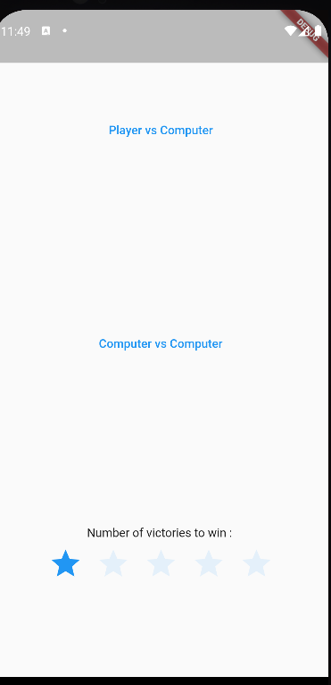
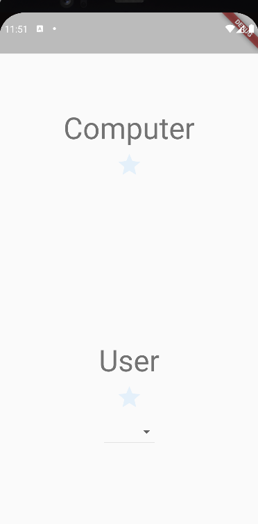
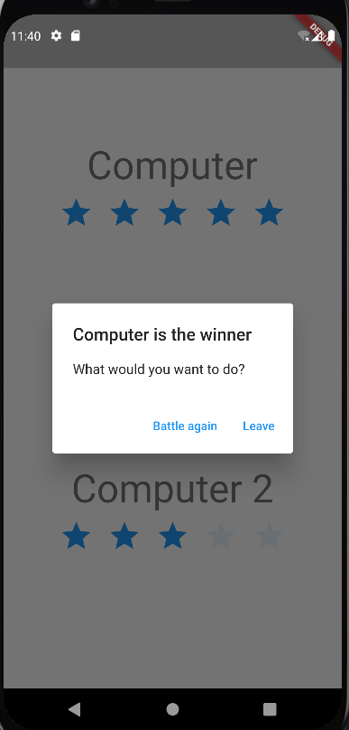

# RPS ( Rock Paper Scissor)

RPS (Rock Paper Scissor) is your new time spending app.
You can play Rock Paper Scissor against a computer
Or what a CvC (Computer vs. Computer) game.  
It's fun and you can customise the number of wins to get
Win the game, by simply clicking on the Stars below.

## Getting Started

First, select the number of wins to win the game by clicking the stars below (from 1 to 5)
Secondly tap on the game mode you want to play (Computer vs. Computer: if you want to watch an autonomous game or Player vs. Computer: to play the game).

After you are redirected to the fight Page. If you choose the PvC mode, you have to select a move in the drop-down under your name. Else on CvC, each 2 sec the computer play around.
At the end of the round a Snackbar.

Now someone wins the game so the popup appears you have to choose between: battle again (restart a game) or leave (go to home page).

## Development

It was a quick project, with no package imported so have to do a very simple architecture. With no Bloc package (Bloc pattern mixed with a clean architecture would be my first choice to do this project because the I and the Bloc are more split than Controller), so I had to choose a design pattern, that is easy to implement, fast to code and easy to read. So I choose to implement a **MVC pattern**.

In order to simplify the process to create a new game variant I create the GameLogicMixin to offer the opportunity to create another GameLogic.
So to create a new game mode you just have to implement a GameLogicMixin and create an enum with all the possible plays.

So if I had more time I would make the fight Page more generic to allow the user to select a game. (Like a game mode attribute in the FightArgument to select the game mode and load the list of inputs to players).

# Quality

In order to improve the quality of the code I use the Dart Linter you have all the parameters of the linter in the file 'analysis_options.yaml'.

And I write docs comments ( '///') to help the developer to learn how to use it.
I also did a some manuel test, (no time to configure a TDD process).

But I placed a UITest in order to avoid regresion issues.
And I place Unit Test to test the RockPaperScissor Logic.

All tests are in the file : **./test/widget_test.dart**
